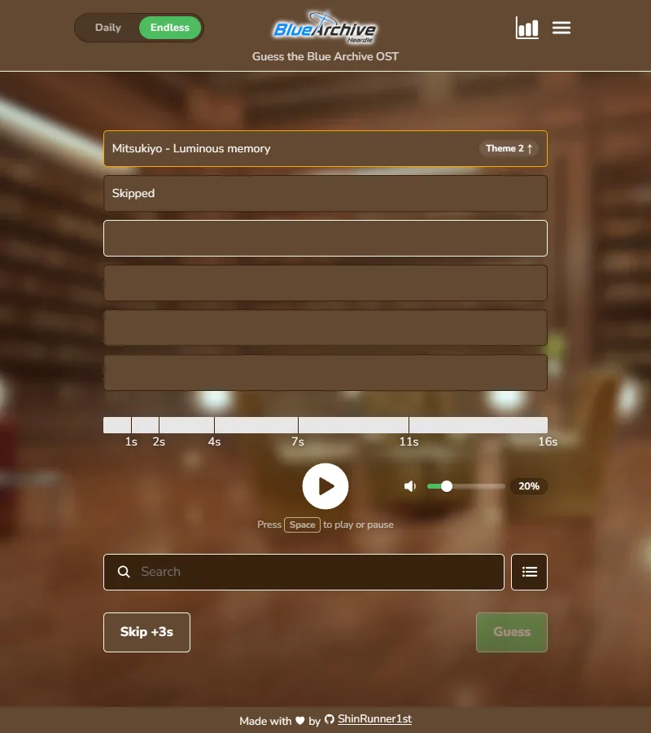
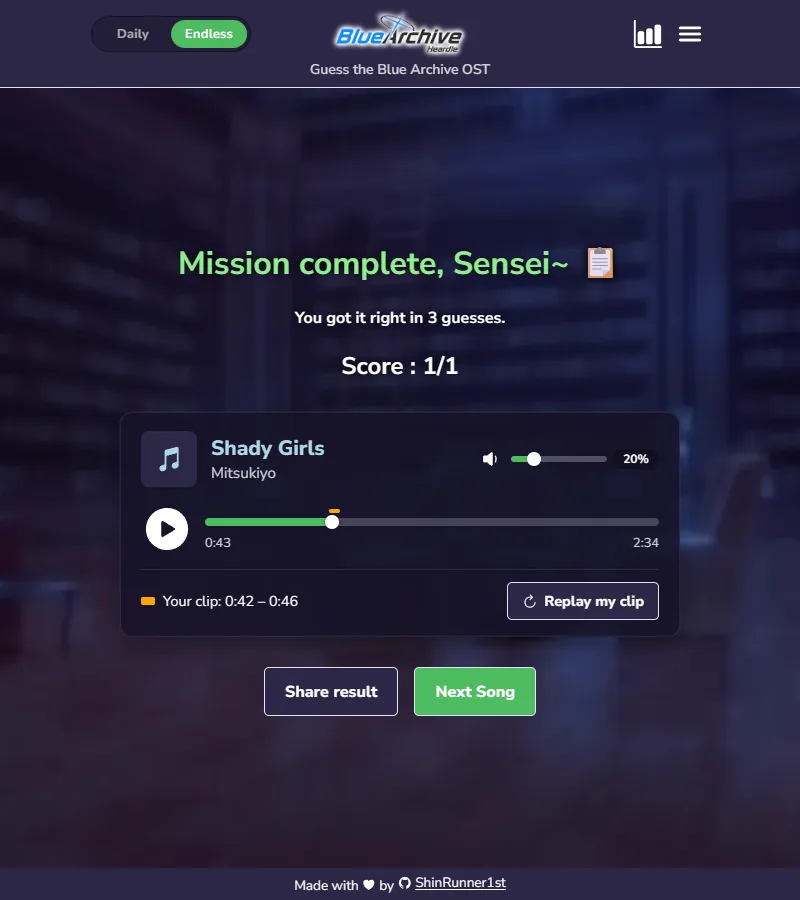

# Blue Archive Heardle

A Heardle-style game: guess the Blue Archive OST from a few seconds of music.
Or switch games and name a Blue Archive student from their voice, their halo
or weapon, or how each guess compares.

**Play it at [baheardle.com](https://baheardle.com/)**

The home page has a card for each game, with how today's daily puzzles went
and a button to carry on with the game played last. Each game has its own
page: [/ost](https://baheardle.com/ost), [/voice](https://baheardle.com/voice),
[/students](https://baheardle.com/students) and
[/picture](https://baheardle.com/picture). The bar under the header moves
between them without reloading, and the logo goes back home.

Below the cards, the hub has **Your record** across every game (for anyone
who has played; its button opens the Sensei card), **Now in Global** (the
pickup students, the event and the raids on the Global server, each with
when it ends) and **Birthdays this week**, with the students' portraits.
Each card shows one of the game's scenes behind it.

<p>
  
  
</p>

## How to play

You hear a short clip from a random point in a track. Guess the song, or skip
to hear more: each wrong guess or skip makes the clip longer (1s → 2s → 4s →
7s → 11s → 16s). You get six tries.

A wrong guess shows its theme number with an arrow pointing towards the
answer's, and turns orange when it is within 10.

### Modes

- **Daily** - one track a day, the same for everyone. Keeps a streak and
  shares a spoiler-free result.
- **Endless** - as many rounds as you like. No track repeats until every one
  has been played. A switch above the game picks how to play it:
  - **Classic** - the six tries above.
  - **4-Choice** - a short clip (1, 2, 3, 5 or 7 seconds, 3 to start with;
    remembered), then one pick from four answers, with a tap or the keys 1
    to 4. The wrong answers are picked to sound close: one
    by the same composer when there is one, the rest from nearby theme
    numbers. The four are saved with the round, so a reload deals the same
    four.
  - **Time Attack** - as many songs as you can in three minutes, one try each.
    Pick the clip length (1, 2, 3, 5 or 7 seconds), a random start inside the
    16-second clip, and typed or four-choice answers. Each clip plays as soon
    as it loads and the next one loads while it plays; the clock stops while a
    song loads. After each answer the result shows before the next song: a
    right one for a moment with the clock stopped, a miss or a pass for two
    seconds with it running, so tapping or passing at random doesn't pay. Quit
    ends a run early. A run isn't resumed after a reload: it ends with what was
    answered, so a reload can't win time back. The end of a run shares as text
    or a picture, neither naming a song.

Each mode keeps its own score, streak and history, saved in your browser.
4-Choice and Time Attack earn no OST badges, since picking from four (or
naming against the clock) isn't the same test.

### Students

The game at `/students`: guess the student, in the style of other Blue
Archive "-dle" games. The header's Daily and Endless work here too. Type a student's name (either name, in either
order: "armed hoshino" finds Hoshino (Armed)) and the guess goes straight into
the table, newest on top, a column per attribute: green when it matches the
answer, yellow when it's close, red when it doesn't, with an arrow for numbers
pointing higher or lower. Schools, roles, gifts and damage and defense types
show their icon (a type is the sword or the shield on a circle of the game's
colour for it), with the name under it when it's short. The grid button
beside the search box opens every student in the pool as icons, sorted by
name so the list says nothing about release order. Picking a name, from the
list or the grid, puts it in the box, and Enter or the Guess button in the box
sends it, as a song is picked and then guessed in the OST. Before the first
guess, Random first guess picks someone to start with (never the answer).
There's no limit on guesses; Give up (pressed twice, and set apart from the
grid button) counts as a loss. A second switch picks how to play:

- **Gameplay** - school, role, damage type, defense type, weapon type, EX
  skill cost (at level 1) and release order. Every costume is its own answer, since its kit
  differs: 262 on Global.
- **Lore** - height, school, birthday (the right month is close), school year,
  weapon type, favourite SSR gift (sharing one is close), club and release
  order. Default costumes only: 144 on Global, Shiroko\*Terror among them.

Each way to play keeps its own daily and endless rounds, stats and streak.
Daily is one student a day, the same for everyone, from a schedule in
`src/constants/studentDailyOrder.ts` that is only ever added to, like the
OST's. Endless deals every student once before any comes round again. The
result names the student; its share text is squares only, so it spoils
nothing, and so is its share picture on a daily puzzle (an endless one shows
the student). Stats has Share recap, like the OST's. On a student's birthday a card at the top of the page wishes them a
happy one, with their portrait, in every game. The portraits are a file each
on the Worker (about 7.5 KB), and their list (`portraitFiles.ts`, shared
with the Sensei card) loads only on a birthday, so an OST player never
downloads the 450 KB icon sheet for it.

### Voice

The game at `/voice`: hear a student's line and
name them. Each round plays one line, whole: the student's title call ("Blue
Archive!", about a second, and the same words for everyone) or one of four
lobby lines, replayable as often as you like. Every costume is its own answer,
since each has its own recording, and there's no "close" for the right
student in the wrong costume. Type a name or pick from the grid of every
student, then press Enter or Guess, as in the OST; the search results open
upwards, as the OST's do. You get four tries, and each
miss or skip opens a hint: the student's school, then their club, then their
silhouette. The hints aren't in the page until they open.

- **Daily** - one line a day, the same for everyone, from a schedule in
  `src/constants/voiceDailyOrder.ts` that is only ever added to. Hints on.
- **Endless**, with its own switch:
  - **Classic** - four tries with hints, as above. A Hints switch above
    the game turns them off: four tries and nothing but the voice, with its
    own score and stats (No hints). It sits there, as 4-Choice's clip length
    does in the OST, because a fourth pill didn't fit beside the game switch.
  - **4-Choice** - one pick from four students whose voices sound alike: the
    wrong three are dealt from the eight voices nearest the answer's (see
    Voice lines), a different three each time. Never another costume of the
    answer or two of one student, since the same voice twice would leave a
    guess between outfits. Time Attack's 4-Choice deals the same way.
  - **Time Attack** - as many students as you can in three minutes, one try
    each, typed (with the grid too) or from four, played like the OST's. It
    can play every line or title calls only ("Blue Archive!" from everyone,
    so only the voice tells them apart); each keeps its own best.

Each mode keeps its own score, streak and stats, and daily has a calendar.
The result has a card like the OST's now-playing one: who it was, your record
with their voice, what they said in the official English (read from the
Worker once the round is over, so the words can't be looked up while
playing), and the line to play again and seek in. The share text is squares
only; Share picture draws the round (a daily one names nobody) or the Time
Attack run, and Stats has Share recap for every mode.

### Picture: halos and weapons

The game at `/picture`: see a halo or a weapon and name its student.
Halo or Weapon is picked above the game, in every mode, and each keeps its own
rounds. A student's costumes share a halo, and most share a gun (Aru's rifle
is the same in all three of her outfits), so each picture is one answer and
naming any student it belongs to is right. The twins Hikari and Nozomi share
a halo too. That makes 143 halos and 154 weapons. Type a name or pick from the
grid, then press Enter or Guess, as in Voice; a wrong guess rules out everyone
sharing its picture. You get four tries, and each miss or skip opens a hint:
the school, then the club, then the student's silhouette (Voice's). The
picture shows on a slate tile, which suits pale halos and dark guns alike.

- **Daily** - one halo and one weapon a day, the same for everyone, from the
  schedules in `src/constants/guessDailyOrder.ts`, only ever added to. Always
  the picture itself.
- **Endless**, with the OST's three. The row above the game has toggles
  beside Halo and Weapon: **Silhouette** shows only the picture's shape,
  white on the tile, and in Classic **Hints** turns the hints off. Each mix
  is its own way to play, with its own score and stats, as Voice's No hints
  is, and each pill remembers the mix it had last.
  - **Classic** - four tries, with hints or none. With the silhouette on,
    the last hint is the picture itself.
  - **4-Choice** - one pick from four students, the picture or its
    silhouette: for a halo, two from the answer's school where there are;
    for a weapon, two with the same kind of gun (SG, AR...); never another
    costume of the answer.
  - **Time Attack** - as many as you can in three minutes, typed or from four,
    pictures or silhouettes, each with its own best.

The result shows whose it was (everyone sharing it, and a weapon's name), your
record with the picture, and the picture itself. Share text is squares only;
share pictures (a daily one names nobody) and Stats' recaps work as Voice's.

### Multiplayer

The page at `/multiplayer`: a private room where up to 8 friends play the
OST, Voice or Picture game together, everyone hearing the same song at once,
as in Anime Music Quiz. One player makes a room and shares its four-letter
code, or its link (`/multiplayer?room=ABCD`); the others type a name (kept
for the next room), pick a student as their picture (or keep their name's
letter) and join; a room with a password asks for it in a pop-up. The host
can pick the settings before making the room (the gear beside Make a
room), and keep any as a named preset in the browser (twenty at most, in
a list that scrolls; the same settings saved again rename theirs). A
preset's ⧉ copies it as a short code (`BA1.ost.choice.10.20.…`) for a
friend, who pastes it in with Import. The lobby shows the settings in a
few words; only the host changes them, in the same pop-up (the lobby's
gear), which sends them once, on Save: OST, Voice or Picture (halos or
weapons, silhouettes or not), typed answers or 4-Choice, 5 to 30 rounds,
5 to 40 seconds to answer, where each song starts (anywhere, or the top),
the room's own Global or JP for Voice and Picture, the most players, 2 to
8, and **who can join**: anyone with the code, only with a **password**
(case, spaces and lookalike letters don't matter; it's never sent to the
pages), or nobody new (**locked**: everyone in it can still come back). A
new room can have a password, not a lock. A game needs two. If the host
leaves, whoever joined next takes over. The host can **kick** a player,
twice to be sure: their browser can't come back to that room, from any
tab. A lobby where nothing happens for 10 minutes closes, after a
minute's warning with an "I'm still here" button.

While a player is in a room, nothing takes them out of it by a slip: the
logo and the game bar are dimmed and say to leave first, Back stays on
the page, the Jukebox waits while a game plays (it would stop the round's
song), and during a game the browser asks before a reload or a closed
tab. Leave is the way out.

The first round counts in, 3, 2, 1; every round then plays for everyone at
once: a song for the whole time to answer, with no pause or seek, from the
whole song; a voice line, which can be played again; or a picture. Players
pick an answer and press Submit (or turn on Quick answer, remembered, and
the first pick goes at once). Then they change it as often as they like,
as in Anime Music Quiz: each change is sent as it's made, 0.4 seconds
apart at least (one sooner waits, and the latest pick goes), and the room
takes one every 0.3 seconds at most. Every card shows live when that
player's latest answer reached the room ("3.24s"), never what it is. Once
everyone has sent one, the time left drops to 3 seconds, for a change of
mind. The latest answer the room took counts, timed by when it reached
the room: A at 3.2 s, then C at 7.8 s, is C at 7.8 s. The room decides
everything by its own clock: no answer before the song starts, for
another round, or after the time's up (bar 1.5 s for one sent as it ran
out) or the reveal, and a page saying the time is up moves nothing before
it is. Leave and End
game are small, apart, and need a second tap, so a stray one doesn't
throw the game. End game asks the others: it ends once more than half of
the players there agree (the host's is one; two players both), and the
ask lapses after 20 seconds. The reveal shows the answer where the song
played (a song's album cover, name and artist, or the student, and a
picture game's picture) and what everyone said while the song plays
again from its start, and the next song downloads meanwhile: the
next round starts once everyone has it, after 6 seconds at least and 12 at
most, without a slow connection. A right answer is a point; a tie goes to
the faster over their right answers, and a tie on both shares the place.
After the last round come the standings, the top three on a podium, and
every answer with who named it. Each player goes back to the lobby when
they like, the host staying host; the room is a lobby again once everyone
has, or after 30 seconds.

A dropped connection or a reload comes back as the same player, with their
score. So does someone whose tab closed, joining again from the same
browser: it keeps the tab's token for the room a few hours. A name alone
never brings a player back, so nobody can take another's place and score
by typing their name.
Anyone can join a game halfway through and play from there. Nothing is saved: no
stats, badges or streaks. The whole flow, what the page and room say to
each other and what it costs, is in [docs/multiplayer.md](docs/multiplayer.md).

### Fitting the window

The page is the window's height and never scrolls itself: the header, the
switches and the footer stay put. When a game is taller than the room left,
as on a small laptop or a phone, only the play area between them scrolls,
with a thin bar. Voice and Picture show their four tries two to a row, so
they need no more height than the OST, and every game fits a 1080p window.

### Finding a song

- Type a **name**, an **artist** or a **theme number** in the search box.
- Or open **All OST** (the list button beside it) to browse every song, filter
  by one or more artists, and tap one to pick it.

### Also

- **Result picture** - Share picture on the result screen draws the round as
  a picture for X, on the backdrop you're playing on, and opens your phone's
  share sheet (or saves it on a computer). A daily picture never shows the
  song; an endless one does, since that round is over for everyone.
- **Recap** - Share recap in Stats draws the mode's record as a picture in
  the same style: rounds, win rate, streaks, the guess spread, songs guessed
  and badges. Time Attack's has runs, its best scores and the best run at
  each clip length. It names no songs.
- **Player name** - ☰ → Settings takes a name, drawn as "… Sensei" on every
  picture you share and the Sensei card; a switch under it leaves the
  "Sensei" off. It's used for nothing else and stays in your browser; leave
  it empty to share without one.
- **Daily calendar** - daily stats show every puzzle on a month calendar,
  coloured by how it went: greener for fewer tries, red for a loss, faint
  for a day not played. It names no songs, so it spoils nothing.
- **Result screen** - plays the answer from where your clip started (by itself
  only when you just finished the round; switching to a mode whose round is
  already over, or reloading, waits for the play button), marks
  which part was your clip, and can replay just that part. Under the song it
  shows your record with it in Daily and Classic, such as "Heard 4 times ·
  guessed 3 · best in 2 tries".
- **Jukebox** - in the ☰ menu: every song in theme order, played in full,
  with its OST album's cover when it's on one,
  with a search box and OST album chips (Vol.1 to Vol.8 and Other, any
  number at once, folding to one row), like All OST. Songs guessed right in any mode are bright,
  the rest dimmed; missed songs look like unplayed ones, so it never shows
  what is left in the endless bag. The repeat button (remembered) goes off →
  play the next song → repeat this song → off. Starting a song pauses any
  other playing on the page. Both lists draw their rows from one shared
  component (`src/components/SongRows`) with plain elements, fixed columns
  and off-screen rows skipped, so they open and refilter quickly. The music
  plays on after the Jukebox closes, on every page, in a small player at the
  bottom right (play or pause, next song, back to the Jukebox, stop): a bar
  above the footer, where the play area ends so it covers nothing, floating
  beside the game only on screens wide enough for it (1344 px). It plays until
  something else plays: an OST clip, a voice line or a result's song stops
  it. The Students and Picture games have no audio, so it plays on there
  for as long as you like.
- **Volume** - set it once; it's remembered. New players start at 20%.
- **Reset stats** - ☰ → Settings clears the rounds, stats and streak of the
  game and mode on screen, named on the card, and no other. It asks twice.
- **Dark mode** - in the ☰ menu. Follows your device until you pick one.
- **Blue Archive cursor** - the game's cursor, with its flash on every click
  and trail when you drag. Turn it off in ☰ → Settings to use your own.
- **Streak places** - every 10 wins in a row moves the background somewhere
  new in Kivotos, by day or by night to match the colour scheme, up to the sky
  above Kivotos at 100. Each mode keeps its own: Classic and 4-Choice count
  wins in a row, daily counts its day streak, and a Time Attack run counts its
  score, from the library again with each run. Where the next place is, and when, stays a
  surprise until you reach it; a loss sends the background back to the Trinity
  library. The places are listed in `src/constants/streakPlaces.ts`; their
  pictures are the game's scenario backgrounds, blurred and dimmed so the game
  reads over them.
- **Seasons** - from 18 to 26 December the library becomes a lodge decorated
  for Christmas, and from 31 December to 7 January a shrine at New Year, on
  the player's own calendar. A streak place still shows from 10 wins, and a
  lost streak goes back to the season's picture. The dates are in
  `src/constants/seasons.ts`; the pictures are served from the Worker (see
  [Pictures on the Worker](#pictures-on-the-worker)).
- **OST badges** - one for each official soundtrack album, Vol.1 to Vol.8,
  earned by guessing every song on it at least once, in Daily or Classic. ☰ → OST
  badges shows each album's progress; the result screen says when a
  round adds to one. The albums' songs are in `src/constants/volumes.ts`, from their
  published tracklists.
- **Character** - on wide screens, Arona (light mode) or Plana (dark mode)
  stands beside the game and reacts to your guesses. Hold her to make her look
  at you, stroke her head, or tap her. ☰ → Settings swaps in Mari or turns
  her off.
- **Save file** - ☰ → Settings exports your progress in every mode to a
  file, scrambled like the saves, and imports it in another browser or on
  another device. The file is made and read on the device; nothing is
  uploaded. An import is checked like a save, shows what's in it and asks
  before it replaces the progress there.
- **Sensei card** - ☰ → Sensei card draws the player's record across every
  mode (songs and students found, badges, best streaks, Time Attack best,
  rounds played) on a Schale licence, with the player name from Settings and
  a favourite student's portrait, remembered like the name and not in the
  save file. Share or Download it. The card's code and the portrait list
  load only when it opens, and only the favourite's portrait is fetched.
- **What's new** - after an update, returning players see what was added,
  once, with the two updates before it for anyone who missed them. It stays
  in the ☰ menu. The updates are listed newest first in
  `src/constants/whatsNew.ts`; add a new one at the top, with its own `id`, to
  show the pop-up again. It tells players what they'll notice (a new game or
  mode, new students), not how the site is built.
- **Pop-ups** - never taller than the screen: the title and buttons stay put
  and only the middle scrolls. On a phone they rise from the bottom as a
  sheet, and every one has a ✕ in its corner.

### Keyboard

A round can be played start to finish without the mouse.

| Key           | Action                                                     |
| ------------- | ---------------------------------------------------------- |
| `A–Z`, `0–9`  | Start typing anywhere and it goes into the search box      |
| `Space`       | Play or pause the clip, or the answer on the result screen |
| `↑ ↓`         | Move through search results                                |
| `Enter`       | Pick a result, submit your guess, then go to the next song |
| `Shift+Enter` | Skip, give up on the last try, or pass in Time Attack      |
| `1–4`         | Pick an answer in 4-Choice                                 |
| `Esc`         | Clear the search box, close a pop-up                       |

In the student game, `Enter` guesses the highlighted name, or the top one, and
moves on to the next student from the result.

`Space` types a space only while you are typing a name; in an empty search box,
or one showing the song you picked, it plays the clip.

## Development

React 19, TypeScript, Vite and styled-components, tested with Vitest. Needs
Node 22.18 or newer (`.nvmrc` pins 24).

```bash
npm install
npm run build:audio   # once: builds the audio into audio-dist/ (needs ffmpeg)
npm run dev           # http://localhost:3000
```

`npm run dev` plays the audio from `audio-dist/`. Without ffmpeg, put
`VITE_AUDIO_BASE_URL=https://ba-heardle-audio.shinrunner1st.workers.dev` in a
`.env.local` file to play the deployed audio instead.

| Script                        | What it does                                          |
| ----------------------------- | ----------------------------------------------------- |
| `npm run dev`                 | Start the dev server                                  |
| `npm run build`               | Type-check, then build to `build/`                    |
| `npm run preview`             | Serve the build as the live site does, headers too    |
| `npm run deploy:site`         | Publish the build to Cloudflare (CI does, from main)  |
| `npm run deploy:site-preview` | Build this branch and publish it to the preview       |
| `npm run rooms`               | Run the multiplayer rooms locally, for `npm run dev`  |
| `npm run deploy:rooms`        | Publish the rooms Worker (CI does, from main)         |
| `npm test`                    | Run the test suite                                    |
| `npm run lint`                | ESLint, warnings included                             |
| `npm run typecheck`           | `tsc --noEmit`, the site's and the rooms Worker's     |
| `npm run format`              | Rewrite files with Prettier                           |
| `npm run songs`               | After adding songs: everything below, in order        |
| `npm run students`            | After a Global update: students, voices, then `songs` |
| `npm run voices`              | The voice lines and silhouettes, then `songs`         |
| `npm run build:students`      | Copy the student data and draw the icon sheet         |
| `npm run build:voices`        | Pick and download new voice lines, draw silhouettes   |
| `npm run build:voice-tones`   | Find the voices that sound alike, for 4-Choice        |
| `npm run build:voice-audio`   | Put the voice lines in beside the audio               |
| `npm run build:daily-order`   | Extend the daily schedule                             |
| `npm run build:audio`         | Build the served audio from `audio/`                  |
| `npm run build:pictures`      | Copy `pictures/` in beside the audio                  |
| `npm run upload:audio`        | Upload the audio and pictures to Cloudflare           |
| `npm run upload:backup`       | Copy new files to the backup on Cloudflare R2         |
| `npm run check:audio`         | Check the served audio is complete                    |
| `npm run check:pictures`      | Check the served pictures are up to date              |

A pre-commit hook runs the format check, lint and type-check, and commit
messages follow [Conventional Commits](https://www.conventionalcommits.org/).
CI runs all of that plus the tests, `check:audio`, `check:pictures`, a build
and the page check on every push to `main` and every pull request.

### Page check

`npm run check:pages` (after `npm run build`) opens the built site in a
headless Chrome, through `wrangler dev` with the site's own Worker config
(so with the live site's headers: anything the Content-Security-Policy
blocks fails the check), and goes through it as a player
would, on Global and then on JP: the hub, the OST, Voice, the student grid,
and Picture's daily halo and weapon and Endless with and without
silhouettes. It fails on an error on the page, a file that doesn't load,
or a picture cut wrong from its sheet: every `` must have loaded, and
every cell drawn from a sheet must be cut at the sheet's own proportions,
inside it, and not blank (about 600 pictures a run). That is what the unit
tests can't see; it caught Global's squashed halo sheet when put back. On
a failure it saves screenshots in `check-pages-output/`, which CI keeps as
the run's `check-pages` artifact.
`npm run check:pages -- --url <address>` checks a deployed site instead,
such as the workers.dev address after `npm run deploy:site`.

The pictures come from the Worker, as on the live site, so a new sheet must
be uploaded (`npm run songs`) before its pull request passes. Chrome is
found at `CHROME_PATH` or where it usually installs; GitHub's runners have
it. Only `puppeteer-core` is installed, which downloads no browser of its
own.

### Weekly content update

A GitHub Action, `.github/workflows/content-update.yml`, keeps the game up to
date on its own, every Wednesday (and from the Actions tab by hand):

1. It installs Python with UnityPy and pinned releases of BA-AD and BA-AX
   (see [The game's files](#the-games-files)), and downloads the game's
   music (`npm run download:music`) into `.cache/baad`, kept between runs so
   only new files come down. If that fails, the download kept from before
   and the wiki are used that week.
2. `npm run find-updates` looks, without building anything, for students
   SchaleDB has that the table doesn't (JP covers Global's upcoming ones) or
   that have come out on Global, voice lines and halos that have come out for
   a student without them (in the game's files, or from SchaleDB and the
   wiki), halos the wiki now has for a student whose halo was drawn from the
   game's files meanwhile, and tracks in the game's music or on the Blue
   Archive wiki's Music page that the song list doesn't have (not the
   10000-range specials), or titles
   and artists for songs still half named. A song with either half still
   blank ("Theme N" or by "Unknown") follows the wiki for both, so a
   correction to the other half comes along; once both are filled it is the
   list's own, and the wiki's spelling (typos, Japanese titles) never
   replaces it. Differences only of case or punctuation don't count.

   A new track's file comes from the game (`scripts/lib/gameTracks.mjs`):
   `Theme_<n>.ogg`, or when the game has only a variant, `_Title`, then
   `_Short`, then `_Short_Inst`, then the first by name, which the pull
   request names so it can be checked. On 2026-09-29 all 345 songs were byte
   for byte the game's files (154, 269 and 271 its `_Title`, 185 its
   `_Short_Inst`, 314 its `_Short`), and all the wiki has too. A track only
   the wiki has comes from the wiki, checked against its SHA-1. Names always
   come from the wiki; 269, 271 and 314 aren't on its Music page, so they
   stay "Theme N" until named by hand. Locally, point `BAAD_OUTPUT` at a
   BA-AD download of your own (its `output` folder) to use it.

   GitHub's runners can't reach the wiki: Miraheze, which hosts it, shows
   them a bot check ("Checking your connection...", 403) whatever the
   User-Agent. So the Action's new tracks come in from the game as
   "Theme N" by "Unknown", and the run and the pull request say so in a
   warning. Name them from home, where the wiki answers:
   `npm run build:new-songs` fills in every song still half named, or edit
   `src/constants/songs.ts` in the pull request. A Music page that answers
   but has lost its tracks still stops the run.

3. Only if there is something, it runs `build:students`, `build:voices` and
   `build:guess`, adds the songs (`npm run build:new-songs`), and builds the
   audio and pictures as `npm run songs` does. A sheet or portrait is drawn
   again only when the pictures it's drawn from change
   (`pictures/sources.json`, by their pixels), so a run on GitHub's ffmpeg
   doesn't change their bytes and send every player new copies. The pull
   request lists anything that came from SchaleDB or the wiki because the
   game's files didn't have it.
4. It runs the full check, uploads the new files to the Worker and R2,
   checks them there, and runs the [page check](#page-check) on them. If
   anything fails, no pull request opens; the run's page shows why, with
   screenshots.
5. It opens a pull request, `auto/content-update`, listing what's new. It
   never pushes to `main`; merging the pull request is the release.

It needs the `CLOUDFLARE_API_TOKEN` secret to have both Workers Scripts and
Workers R2 Storage edit rights, `CLOUDFLARE_ACCOUNT_ID`, and Settings →
Actions → General → "Allow GitHub Actions to create and approve pull
requests". GitHub runs scheduled workflows from `main` only.

### Adding a song

Songs are added by the weekly Action. To add one by hand:

1. Put its audio in `audio/Theme_{themeNo}.ogg`. Themes below 10 are
   zero-padded: `Theme_01.ogg`.
2. Add its entry to `src/constants/songs.ts`:
   ```ts
   { artist: "Mitsukiyo", name: "Constant Moderato", themeNo: "1" },
   ```
3. Run `npm run songs`, and commit what it changed.

`npm run songs` needs Node 22.18 or later,
[ffmpeg](https://ffmpeg.org/download.html) (with ffprobe) on the PATH, and a
Cloudflare login (`npx wrangler login`, once per computer). It:

- extends the daily schedule, `src/constants/dailyOrder.ts`. It is only ever
  appended to, so adding songs never changes a day that has already been
  played;
- builds the new or changed audio into `audio-dist/` (see [Audio](#audio)),
  and copies the [pictures](#pictures-on-the-worker) in beside it;
- uploads it all to Cloudflare, and checks that every file is there.

Commit before merging: the game only asks for files that are already
uploaded, so the upload has to happen first, and `npm run songs` does it.

Replacing a song's audio is the same: swap the file in `audio/` and run
`npm run songs`. A new artist needs nothing else: the All OST filter and the
About credits are built from the song list. If a step is forgotten, CI fails,
and so does a test.

### Audio

The audio is served by a Cloudflare Worker that only serves files
(`audio-worker/`), apart from the site's own. Requests for its files are
free and unlimited, and keeping 450 MB of audio out of the site means a
deployment of the site doesn't upload it again.

The originals live in `audio/`, named by theme number, and are never served.
`npm run build:audio` turns each one into two files in `audio-dist/`, which
is not committed:

- **its clip**, 16 seconds cut from a fixed point in the song. It is all a
  round downloads, about 0.2 MB;
- **the whole song**, which the result screen fetches once the round is over
  and plays from where the clip started.

The game downloads each file whole and plays it from memory
(`src/helpers/audioSource.ts`): Cloudflare's static files don't answer
requests for part of a file, which Safari needs to play from a server and
other browsers need to seek. `_headers` also allows the game, on another
address, to read the files. Whole songs are also kept in the browser's Cache
Storage, the 30 played last (about 60 MB), and played from there next time,
so listening in the Jukebox doesn't ask for a song again even once the
browser's own cache has let it go. Clips aren't kept: a round plays each
once.

Both are named with a salted hash of the theme number and a fingerprint of
the original, so a request in DevTools says nothing about the song, and a
replaced song gets new names. That lets browsers and Cloudflare keep every
file for a year (set in `audio-dist/_headers`), and a replaced song still
reaches everyone at once. Every player hears the same clip of a song. Where
each clip was cut, each song's length and its fingerprint go into
`src/constants/audioClips.ts`, which is committed; `check:audio` fails in CI
if it doesn't match the originals.

The saved rounds in `localStorage` and the daily schedule in the code are
scrambled too (`src/helpers/obscure.ts`), and the track name in the browser's
media controls is hidden. None of this is encryption: the game has to know the
answer to check a guess, so someone who reads its code closely can still find
it. It keeps the answer from being a glance away.

`src/helpers/audioFiles.ts` is the one place that decides the names, and the
game and the scripts both use it. Changing its `SALT` renames every file.
`.env.production` holds `VITE_AUDIO_BASE_URL`, the Worker's address, which
production builds read from; `npm run dev` serves `audio-dist/` itself.

#### The backup on R2

A copy of `audio-dist/` lives in the Cloudflare R2 bucket `ba-heardle-audio`,
served at `https://audio.baheardle.com` (`VITE_AUDIO_BACKUP_URL`). When a file
doesn't come from the Worker, the game asks the backup for it instead
(`src/helpers/audioSource.ts`), so a Worker outage doesn't stop the game.
`npm run songs` runs `upload:backup`, which uploads only the files the backup
doesn't have yet, and then checks both servers.

The Worker stays first because its requests are free and unlimited. R2's are
free only up to a monthly amount (10 GB stored, a million writes and ten
million reads), and past that they are charged to the card on the Cloudflare
account; R2 has no spending cap. So:

- Normal play never touches R2: only a failed Worker request does.
- Cloudflare's cache answers repeat requests for a file without asking R2, and
  those don't count. The files are named after their contents, so they are
  sent with a year-long `Cache-Control`.
- The free `r2.dev` address stays off: it is rate-limited and can't be
  cached or protected.
- In the Cloudflare dashboard, R2 has usage alerts (Notifications > Usage
  Based Billing: 9,000,000 reads and 800,000 writes a month), and
  `audio.baheardle.com` has a response header rule adding
  `Access-Control-Allow-Origin: *` (Rules > Transform Rules, "Set static"), which the game
  needs to read the files. Rate limiting is a paid add-on, so there is none. It is a header rule rather
  than the bucket's CORS setting because Cloudflare's cache would keep a
  copy without the header for everyone after one request without an Origin.
- If R2 ever needs shutting off, disconnecting the custom domain does it; the
  game goes on playing from the Worker.

A file that fails to load or decode shows an error with a retry. In endless
mode it can deal a different song instead, and the failing one is left out for
the rest of the session.

### Pictures on the Worker

Pictures that only show at times, like the seasonal backgrounds, are served by
the same Worker as the audio, not with the site. They live in
`pictures/<folder>/`, already made; `npm run build:pictures` copies them into
`audio-dist/pictures/` named after a fingerprint of their bytes, so they can
be cached for a year and a changed picture still reaches everyone at once.
The names go into `src/constants/pictureFiles.ts`, which is committed, and
`check:pictures` fails in CI if it doesn't match `pictures/`. `npm run songs`
uploads them with the audio: an upload without them would take them off the
Worker.

`node scripts/make-backdrop.mjs <BG name> <day|night> <output.webp>` makes a
backdrop from one of the game's scenario backgrounds, downloaded once from the
Blue Archive wiki (`File:BG_<name>.jpg`), blurred and dimmed like the streak
places. The game itself never asks the wiki for anything. `npm run dev` serves
the pictures from `audio-dist/` too; add `?season=christmas` or
`?season=new-year` to the address there to see a season on any day.

`node scripts/make-card.mjs <BG name> <output.webp> [focus]` makes a hub
card's picture the same way, sharp and cut to 720x320 (`focus`, 0 to 1,
moves the cut down the picture). The cards use `Stage` for the OST,
`SchoolBroadcastingRoom_Day` for Voice, `ShootingRange` for Picture and
`ClassRoom` for Students, in `pictures/hub/`: about 86 KB in all, fetched
from the Worker when the hub shows.

### Now in Global

The hub's Now in Global panel ("Now in JP" on the JP server) reads one small
file, `now.json`, holding both servers' schedules, from a second
Worker, `ba-heardle-now` (`now-worker/`), apart from the audio one so it can
be published without the audio, which is built only on the maker's computer.
Like the audio Worker it only serves static files, so its requests are free.
`scripts/build-global-now.mjs` makes the file from SchaleDB's `config.json`
(each server's `CurrentGacha`, `CurrentEvents` and `CurrentRaid`, with their
start and end times) and its English names for students, events and raids; it
stops with an error if the format changes, and the live file stays as it
was. The event's logo and each raid boss's lobby picture come along,
converted to WebP (ffmpeg) in `now-dist/img/` and named after their source's
bytes, so they are cached for a year while `now.json` is kept for fifteen
minutes. The page never asks SchaleDB for anything, leaves out whatever has
ended by the player's clock, and hides the panel if the file doesn't come:
there is no R2 copy, so an outage can't run up R2 reads.

- `npm run global-now` builds and publishes it by hand. For `npm run dev`,
  `npm run build:global-now` only builds it, and the dev server serves it at
  `/now/now.json`.
- `.github/workflows/global-now.yml` does the same every six hours, and
  publishes only when the file changed. GitHub runs scheduled workflows from
  `main` only, and it needs two repository secrets (Settings → Secrets and
  variables → Actions): `CLOUDFLARE_API_TOKEN`, a Cloudflare API token made
  from the "Edit Cloudflare Workers" template, and `CLOUDFLARE_ACCOUNT_ID`,
  from the Workers overview in the Cloudflare dashboard. Run it by hand from
  the Actions tab to check it.
- SchaleDB updates a few hours after the game does, so a new banner can take
  that long to show; one that has ended hides on time.

### Multiplayer rooms

The rooms are the only code the site runs on a server: `ba-heardle-rooms`
(`rooms-worker/`), a Worker with one Durable Object per room, on
Cloudflare's free plan (its SQLite-backed objects). The game itself is
`src/helpers/room.ts`, tested whole in `room.test.ts`; the messages between
page and room are in `src/types/room.ts`, and the page's side is
`src/hooks/useRoom.ts` and `src/components/Multiplayer/`, a chunk loaded
only on that page. A page connects to
`wss://ba-heardle-rooms.shinrunner1st.workers.dev/room/<code>`
(`VITE_ROOMS_URL`) only once its player makes or joins a room. The player
and message flows, with what each costs, are in
[docs/multiplayer.md](docs/multiplayer.md).

- **Fair:** the room deals every round when the game starts and keeps the
  answers. A round goes out as its file's name on the audio Worker (the
  salted hash, see Audio) or its picture's cell in a sheet, and in
  4-Choice with its four answers, which the page shows once the round
  starts; the answer goes to everyone at once at the reveal, the host
  included. As in the other games, someone who worked through the bundle
  could match a file name to its song; that's no easier than there.
- **The free plan's daily limits** (checked 2026-09-30): 100,000 Durable
  Object requests, 13,000 GB-s of duration, 100,000 rows written and 5 GB
  stored, and 100,000 Worker requests.
  - The object hibernates between messages, and is billed for duration
    only while it handles one. The page's keep-alive, every 30 s, is
    answered without waking it, and isn't billed.
  - A connection is one Worker and one Durable Object request. Messages to
    the room count 20 to a request, and messages from it are free. A player
    sends a hello, then about four short messages a round ("ready", an
    answer and two ticks), plus one for each change of mind, nothing while
    typing: a game of 8 players and 20 songs is about 45 requests, so
    about 2,200 such games a day, or 50 to 75 (1,300 to 2,000 a day) with
    the usual few changes. A page sends a change 0.4 s apart at least, and
    past 40 messages in 10 s its connection is closed, so even everyone
    clicking through the answers all game is about 400 (250 a day). A vote
    to end early is one message each.
  - Writes: the room's live part (settings, phase, clocks, host) and each
    player's ride on their connections, which costs nothing, so a lobby
    writes nothing. The game (the deal, the results, a roster of everyone)
    is written when it starts and once a round, at the reveal, and its one
    alarm is for tidying up: about 25 rows for a 20-song game, so about
    4,000 a day.
  - There are no timers on the room, which would each be an alarm, a row
    written: each page ticks when one of the phase's times passes, and
    any message moves the room on if it's due (a page that never ticks is
    waited for 1.5 s at most).
  - A room deletes everything it kept when the last player has been gone
    30 seconds (a lobby, which keeps nothing, goes at once), or when the
    game goes back to the lobby. A lobby nobody does anything in for 10
    minutes closes on the pages' tick, sending everyone out.
  - When an allowance runs out, a page that can't get in after two tries,
    or a room whose writes fail, says Multiplayer is resting until
    tomorrow. A page already in a room that loses it (five tries, about
    30 s) says the connection may have dropped or the allowance run out,
    as it can't tell which. The free plan's daily limits reset at 00:00
    UTC, and past them requests are refused, never billed. Nothing else on
    the site depends on it.
- **Only the site's pages** can use it: it answers pages from
  baheardle.com, the site's workers.dev and preview addresses and
  localhost, and nothing that isn't a room's address wakes a room.
- **No spamming:** the Worker counts, per address a minute, rooms made (6)
  and connections opened (40), with the rate-limit binding in
  `rooms-worker/wrangler.jsonc`, before any room wakes; past either, the
  page is asked to wait a minute. It counts a SHA-256 of the address, not
  the address itself, and the counter forgets it within the minute. A
  connection sending over 40 messages in 10 s (a round takes a handful) is
  closed the same way: each connection is counted on its own socket (in
  its attachment, so the count outlives the room sleeping between
  messages), so one page's flood never closes anyone else's.
- **What a page sends is checked** before the room reads it: a message is
  1 KB at most and must be one the room knows, each field its type and
  range, and anything else is dropped. Who sent it comes from the
  connection, never the message, and only the host's are taken for the
  host's actions. Names lose control and invisible characters (zero-width
  spaces, right-to-left marks, blank letters) and accents stacked past
  two, and a name that reads as one already in the room (in another
  case, wide letters, or Cyrillic and Greek lookalikes) gets a number, so
  nobody can pass as another player. Everything is shown as text, never
  as HTML. A test sends thousands of random and broken messages through
  a game and checks the room never breaks or shows an answer early. Logs are off, so nothing of a room outlives it.
- **Locally**, `npm run rooms` runs it at `ws://localhost:8787`, where
  `npm run dev` looks for it.
- **Deploying:** CI publishes it from `main`, before the site, with the
  same secrets. A new version restarts every room and drops its
  connections; the pages reconnect by themselves and the room's record
  knows them, so a game carries on from the round it was on, loading it
  again. A lobby, which keeps nothing, is made again by the first page
  back, with the same code and settings. A change to the messages bumps
  `PROTOCOL` in `src/types/room.ts`, and an older page is asked to reload.
  The first deployment, by hand with `npm run deploy:rooms`, created the
  Durable Object class (migration `v1` in `rooms-worker/wrangler.jsonc`).
  The rooms deal from the song list, voice lines and pictures they were
  built with, so one added to the site reaches them with the same release.

### The game's files

The pictures, voice lines and music come from the game's own files, from JP's
servers, on the day of an update. SchaleDB still gives the data (the game's
tables are encrypted, and Japanese only) and each voice line's text, and
names the files: a student's `DevName` and `PathName` are the game's names
for them. Three community tools do the work, each pinned:

- [BA-AD](https://github.com/Deathemonic/BA-AD) downloads the files
  (`scripts/lib/baad.mjs`): the music and voice lines (Android's media), the
  student pictures and weapons (three groups of Android's UI pictures, about
  50 MB), and the students' Spine sprites for their halos (Windows', whose
  textures are full size), or their 3D models' meshes, materials and
  textures where a sprite has no halo.
- [BA-AX](https://github.com/Deathemonic/BA-AX) opens the voice zips.
- [UnityPy](https://github.com/K0lb3/UnityPy) (`scripts/extract-game-files.py`,
  `scripts/requirements.txt`) unpacks the pictures, sprites' atlases and
  skeletons, and the models' halos, from Unity's asset bundles into
  `.cache/game/`, with a hash of each picture's pixels.

`scripts/lib/gameFiles.mjs` puts them together for the build scripts:

- **Icons** are the middle of each student's `Student_Portrait_<name>`,
  cut square, as SchaleDB's icons were; the **Sensei card's portraits** are
  `Student_Portrait_<name>_Collection` (with its background), made 200x226;
  **weapons** are `Weapon_Icon_<WeaponImg>`. A few older costumes' pictures
  aren't under any name we know (Hasumi, Yuuka, Suzumi, Ayane, Chinatsu,
  Wakamo, Hoshino (Armed) and Shun (Swimsuit)'s icons, Hoshino (Armed)'s
  portrait); theirs come from SchaleDB. Names that differ are in
  `NAME_FIXES`.
- **Voice lines**: the title call from `Prologue/Audio/VOC_JP/JP_<name>/`,
  the rest from `GameData/Audio/VOC_JP/JP_<name>.zip`, by SchaleDB's name
  for each line.
- **Halos** stay the Fandom wiki's, whose editors draw them flat, facing us.
  The game only has them as they sit on each student's sprite, in
  perspective, some nearly edge-on (Hare's, Yuuka's), which would be hard to
  name. A halo the wiki doesn't have yet (a new student's) is drawn from the
  sprite (`scripts/lib/spineHalo.mjs`, with spine-core: every halo piece in
  its resting pose, its glow copies left out), and the wiki's replaces it
  once it's there. A sprite without a halo (Marina's has none) leaves it to
  the student's 3D model, the chibi the game battles with, whose halo is a
  flat mesh behind the head (`scripts/lib/modelHalo.mjs`): drawn square on,
  from the side the student faces, in its texture's colour. That is how the
  wiki draws them; checked against 141 of the wiki's, they match but for a
  few the wiki draws tilted, and the colours come out a little duller.

Nothing breaks when the game's files can't be had: every picture, line or
track they don't have comes from SchaleDB or the wiki, as before, and the
pull request lists it. When the game's pictures aren't there at all (BA-AD
or UnityPy missing, the game in maintenance), or more than a tenth of a kind
are missing (the game renamed them), they still come from SchaleDB, so the
update isn't held up, but the pull request warns in bold: merging it swaps
those pictures for SchaleDB's art, and players download the sheets again.
Waiting a week for the game's files is the other choice.

To run the student scripts locally: `pip install -r scripts/requirements.txt`,
and put `baad` and `baax` on the PATH, or their paths in `BAAD` and `BAAX`
(`PYTHON` picks the Python; `python3`, or `python` on Windows, otherwise).

### Student data

The student game's data comes from [SchaleDB](https://schaledb.com/), copied
at build time: the game never asks SchaleDB for anything. After each game
update, run `npm run students` and commit what it changed. It runs
`build:students`, then `npm run songs` to put the new icon sheet on the Worker
and R2. `build:students`:

- downloads `students.json`, `localization.json` and `items.json` from
  `schaledb.com/data/en/`, checks their format and cuts them down to the
  fields the game compares, into `src/constants/students.ts`
  (`src/helpers/studentData.ts` does the converting). If the format has
  changed, it stops naming the student and field, and writes nothing, so the
  live site keeps working. It keeps every student out on JP or Global, each
  marked `global` and `jp` (see [JP server](#jp-server)); a student out on JP
  alone has SchaleDB's English name for them.
- appends new students to each way to play's daily schedule on each server,
  shuffled among themselves, so no day already played changes.
- takes each student's icon from the game's files (see
  [The game's files](#the-games-files)) and draws them all into one sheet,
  `pictures/students/icons.webp` (80 px cells, transparent round each
  student; about 470 KB), in the table's order
  (`src/constants/studentIcons.ts`). One file means one request, and no file
  name per student to give the answer away in DevTools. A new student changes
  the whole sheet, so players download it again after each update.

It also draws a second, small sheet, `pictures/students/clues.webp` (about
50 KB), of the school, role, type and gift icons for the table's cells,
listed in `src/constants/clueIcons.ts`. These are white shapes drawn on the
cells' colours, so this one keeps its transparency. A school SchaleDB has no
icon for (Sakugawa) gets ETC's, which is Schale's emblem. Each attack and
armour type is SchaleDB's sword (`Type_Attack`) or shield (`Type_Defense`)
drawn on a circle of the type's colour, from
`scripts/lib/typeColors.mjs`, keyed by SchaleDB's codes. A type the game adds
later comes into the sheet by itself, on grey, and the script says to add
its colour there. And it makes each student's portrait (the game's
collection picture, about 8 KB as WebP) into `pictures/portraits/`, for the
Sensei card; their names on the Worker are listed in
`src/constants/portraitFiles.ts`, apart from `pictureFiles.ts`, so the page
doesn't carry 262 of them.

Needs ffmpeg built with libwebp, like `build:audio`. A student's favourite gift
is the SSR gift sharing the most tags with them, as the game rates gifts; two
gifts tie now and then, and a few guests from other series have none.

### JP server

Students, Voice and Picture can follow the JP server, a few months ahead of
Global, in place of Global's: a choice in Settings and on the hub
(`src/helpers/server.ts`, the `server` key; Global for new players). The OST
follows JP's soundtrack either way.

- **One table, two pools.** `students.ts` has every student out on either
  server; `onServer()`, `poolOf()`, `voicePool()` and `pictureAnswers()` give
  the pool of the server played now. A picture shared by several students is
  led, on each server, by the first default costume out there, so Global's
  answers are exactly what they were before JP came in.
- **Own schedules and saves.** Each server has its own daily schedules
  (`GAMEPLAY_JP`, `LORE_JP`, `VOICES_JP`, `HALOS_JP`, `WEAPONS_JP`), only ever
  appended to, and its own rounds: JP's are saved under Global's keys with
  `.jp` after them, and in a `jp` field of the save file, so a switch never
  touches the other server's.
- **A switch reloads only the games.** Each student game's hook loads the
  new server's saves as it next renders, and their screens are keyed by the
  server, so nothing else on the page (the background, the character, the
  Jukebox) starts over. The hub's record, daily labels, birthdays and "Now
  in" panel follow it too; the panel reads both servers from one file.
- **Marked where it's shared.** On JP the games' taglines end "· JP server",
  share texts "(JP)", and share pictures' tags "· JP".
- **JP-only students** come with SchaleDB's English name, their lines with
  their Japanese text (the line picker also checks the Japanese name, so no
  line gives it away), and a halo drawn from their sprite (or 3D model)
  until the Fandom wiki has one. Their lines and pictures come from the game's files on the
  day of the update.

### Voice lines

Voice mode's lines come from the game's files, picked and titled by
SchaleDB's `voice.json` (SchaleDB was told before lines were first
downloaded from it). `npm run students` runs `build:voices` after
`build:students`; on its own, `npm run voices` runs it and then `npm run
songs`. `build:voices`:

- downloads `voice.json` and picks each student's lines
  (`src/helpers/voiceData.ts`): the title call and up to four lobby lines,
  idle lines before greetings, no seasonal ones, and none where the student
  says their own name. Newer students' lines are cut into parts, each with
  its own text; the longest part that fits (20 to 140 characters of text) is
  taken from each line.
- takes the lines it doesn't have yet from the game's files (or, for one
  they don't have, SchaleDB's MP3, one at a time with a pause) and converts
  each once to mono Ogg Vorbis in `voices/<student id>/`, which is committed
  like `audio/` (about 66 MB for 1,368 lines). Lines made before, from
  SchaleDB's MP3s, stay as they are. `voices/lines.json` lists each
  student's lines and their text: SchaleDB's English, or Japanese until it
  has the English.
- appends new students to the daily schedule.
- draws every student's icon (the icon sheet's) as a white shape into
  `pictures/voices/silhouettes.webp`, in a shuffled order of its own
  (`src/constants/silhouettes.ts`, scrambled), so a silhouette's place in its
  sheet doesn't match the icon sheet's.
- measures how each student's voice sounds (`build:voice-tones`,
  `scripts/build-voice-tones.mjs`): ffmpeg decodes their lines and the script
  takes the pitch (median and spread, in semitones) and the timbre (mean
  MFCCs, the usual measure of a voice's colour) over the voiced parts. Each
  measure is scaled to its spread across students and weighted, timbre most.
  It was checked against costumes, which share a voice actress: a student's
  other costume is typically the 5th nearest of 261 voices (about the 130th
  by chance). The eight nearest per student go in
  `src/constants/voiceTones.ts` as places in the student table, 2.4 KB
  gzipped; the measures are cached in `.cache/` by the lines' version, so
  an update measures only new students (two minutes for all of them).

`npm run songs` then runs `build:voice-audio`, which copies the lines into
`audio-dist/voices/` under hashed names (`voiceFile` in
`src/helpers/audioFiles.ts`; the version is a fingerprint of all of a
student's lines), writes their text to one `texts.<hash>.json` beside them,
and records each student's line count and version in
`src/constants/voiceLines.ts`, with the few students who have no title call
(their line 0 is a lobby line), for Time Attack's title calls only. `check:audio` checks that file against
`voices/`.

### Halos and weapons

`npm run students` runs `build:guess` (`scripts/build-guess-pictures.mjs`)
after `build:voices`. It:

- groups the student table by picture: halos by the name without the costume
  (Hikari and Nozomi together, as their halos are the same), weapons by
  SchaleDB's `WeaponImg`, which costumes mostly share. The one who stands for
  a group is its default costume.
- takes the weapons from the game's files and the halos from the Blue
  Archive Wiki on Fandom (`<Name> Halo.png`, asked for as the original PNG,
  downloaded once each into `.cache/`), drawing a halo the wiki doesn't have
  yet from the student's sprite or 3D model (see
  [The game's files](#the-games-files)).
  A few are filed under other names on the wiki (Aris as Alice, Hatsune Miku
  as Miku), listed in `scripts/lib/halos.mjs`.
- trims each to its edges (the wiki's canvases are any size), fits it to a
  cell and draws two sheets per kind into `pictures/guess/`: the pictures
  (`halos.webp`, `weapons.webp`, about 600 KB each: drawn at one and a half
  times the size they show, with the transparency rounded to six steps as the
  icon sheet's is) and their shapes in white (`halo-shapes.webp`,
  `weapon-shapes.webp`, lossless). Each sheet has a shuffled order of its
  own, so a place in one says nothing about the other; a silhouette round
  loads only the shape sheet, until its last hint.
- writes `src/constants/guessPictures.ts` (each picture's students, its cell
  in both sheets, a weapon's name; scrambled) and appends new pictures to the
  daily schedules.

The layouts are in `src/constants/guessSheets.ts`. The page never asks the
game's servers, the wiki or SchaleDB for anything; `npm run songs` puts the sheets on the Worker
and R2.

### Characters

The character is a Spine skeleton, drawn with the official Spine 4.2 runtime
(`@esotericsoftware/spine-webgl`) in `src/helpers/spineStage.ts`. Screens
narrower than 1100px, and players who turn her off, never download the runtime
or her files; the others download only the character they see (0.7-1.4 MB),
and the other of Arona and Plana a few seconds later, ready for a switch of
colour scheme. Once shown, she stays loaded if the window narrows, hidden and
not drawn, so widening it again fetches nothing.

She moves the way she does in the game's memorial lobby. Holding her moves her
`Touch_Point` and `Touch_Eye` bones, which her head, hair and eyes follow;
stroking her head plays the pat animation; a tap picks a random expression.
Her expressions for each moment of a round are chosen in
`src/constants/characters.ts`. She pauses while the colour scheme switches and
draws at most 60 frames a second.

To add a character, export her from the game (Spine 4.2 `.skel`, `.atlas` and
`.png`), then:

1. Run `python scripts/build-spine.py <path to .skel> <id>` (needs Python 3
   and Pillow). It copies her into `public/spine/<id>/` with the texture as
   WebP.
2. Add her to `src/constants/characters.ts`: the part of her to frame, her
   touch bones if she has them, and which expression fits each moment.

### Link preview and icons

`public/preview.jpg` (1200×630, the picture X, Discord and LINE show when a
link is shared) and the icons (`favicon.ico` with 16, 32 and 48 pixel
PNGs, `logo192.png` and `logo512.png` for the manifest, and
`apple-touch-icon.png`, square, since iOS rounds it itself) are drawn by
`node scripts/make-preview.mjs`. It serves the pages in `scripts/preview/`
with Vite and screenshots them in headless Chrome or Edge (`CHROME` picks
another), so both use the site's own font, logo and Mari (Idol), whose
dress sets the colours. The icon is her face, flustered (expression 11),
drawn once at 512 pixels and scaled down by ffmpeg; the three larger PNGs
take a 256-colour palette, a third of the bytes. The preview gives no counts of
songs or students, which would soon be out of date. After drawing a new
one, bump the `?v=` on `og:image` and `twitter:image` in `index.html`:
those sites keep a copy of the picture per address. Give it a
folder (`node scripts/make-preview.mjs <folder>`) to try a change without
touching `public/`. The pages are never part of the site's build.

### Project layout

```
src/
  components/   One folder per component, each with a styled-components file
  constants/    Song list, daily schedule, clip lengths, themes, game settings
  helpers/      Search, stats, song picking, daily puzzle, storage, volume,
                colour scheme, audio URLs
  hooks/        useGame (the round-by-round modes), useTimeAttack,
                useStudentGame, useVoiceGame, useVoiceTimeAttack,
                usePage (the hub or a game's page), useRoom (a
                multiplayer room's connection), useVolume, useColorScheme
  image/        Logo and the day and night backgrounds
public/spine/   The characters, made by build-spine
  test/         Render harness and shared setup for the tests
  types/        Shared TypeScript types
audio/          The OST originals, one Ogg file per theme number
voices/         Voice mode's lines, a folder per student, and lines.json
pictures/       Pictures served from the Worker: the seasonal backdrops, the
                student icon sheets and the silhouettes
site-worker/    The Cloudflare Worker that serves the site, build/
audio-worker/   The Cloudflare Worker that serves the built audio and pictures
now-worker/     The Worker that serves now.json, what is on in Global
rooms-worker/   The Worker that runs the multiplayer rooms (Durable Objects)
scripts/        build-audio, check-audio, build-pictures, check-pictures,
                upload-backup, make-backdrop, make-preview, build-daily-order,
                build-spine, build-students, build-voices, build-voice-audio,
                and the helpers they share; preview/ holds make-preview's pages
docs/           README screenshots
```

Game state lives in `useGame`, which keeps Daily, Classic and 4-Choice and
saves each to its own `localStorage` key; `useTimeAttack` saves the songs of
each Time Attack run the same way, tagged with the run, and `useStudentGame`
keeps the student game's four (Gameplay and Lore, daily and endless).
`useVoiceGame` keeps Voice mode's Daily, Classic, No hints and 4-Choice, and
`useVoiceTimeAttack` its runs. Everything read back from storage is validated, so a
corrupted or outdated save starts a fresh game instead of breaking the page.
Save files (`src/helpers/saveFile.ts`) go through the same checks.

## Deploying

The site is served from Cloudflare, like the audio: `site-worker/` is a
Worker that only serves the files in `build/`, with no code of its own, so
requests for them are free and unlimited. It moved there from Vercel's
Hobby plan, whose request and bandwidth limits it had to watch. The free
plan allows 20,000 files of up to 25 MiB each
per deployment; the site is about 70 files and 5 MB.

- **Only `main` deploys**, from CI (`.github/workflows/ci.yml`), and only
  once the format check, lint, type-check, tests, build and page check have
  all passed; the multiplayer rooms go first (see Multiplayer rooms). It needs the `CLOUDFLARE_API_TOKEN` and
  `CLOUDFLARE_ACCOUNT_ID` secrets the Now in Global Action uses. Other
  branches don't deploy: test them with `npm run build` and
  `npm run preview`, which serves the build with `wrangler dev` as the live
  site does, headers and all. `npm run deploy:site` deploys by hand.
- **A preview** of a branch, to try it on the real network before it
  reaches baheardle.com: `npm run deploy:site-preview` builds the branch
  checked out and publishes it to a second Worker,
  `ba-heardle-site-preview` (`site-worker/wrangler.preview.jsonc`), at
  `ba-heardle-site-preview.shinrunner1st.workers.dev`, marked `noindex`.
  It uses the live audio, Now in Global and rooms Workers, whose rooms let
  it in. Saves there are its own, apart from baheardle.com's.
- **The workers.dev address** (`ba-heardle-site.shinrunner1st.workers.dev`)
  stays on, to test a deployment on the real network; it sends
  `X-Robots-Tag: noindex`, so search engines index only baheardle.com.
- **The domain** is a Custom Domain on the Worker; `www.baheardle.com`
  goes to it by a Redirect Rule in the Cloudflare dashboard, and Always Use
  HTTPS sends `http://` on. Cloudflare's Web Analytics (and RUM) stay off
  for the zone: it would inject a beacon into every page, against the
  privacy promise, and the CSP blocks it anyway.
- **Caching** is set in `public/_headers`, which the build copies to
  `build/` and Cloudflare reads (it isn't served itself), to spare requests
  as well as bandwidth. Built files under `/assets/` carry a hash in their
  name, so browsers keep them for a year without asking again. The
  characters, cursor, icons and link preview keep their names, so browsers
  keep them for a week, then go on using them while they check in the
  background. A replaced file under the same name can take up to a week to
  reach everyone; give it a new name to reach them at once. Pages are
  checked each visit (`max-age=0` with an ETag), so a deployment reaches
  everyone at once.
- **Security headers** go on every page from `public/_headers`. The
  Content-Security-Policy lets the page load and fetch only from itself, the
  audio Worker, the R2 backup and the Now in Global Worker, and connect only
  to the rooms Worker, so the privacy
  promise is enforced by the browser too: a new outside address has to be
  added there, or it's blocked (and the page check fails). Styles may be
  inline (styled-components writes them); scripts may not.
  `frame-ancestors 'none'` and `X-Frame-Options` stop other sites framing
  the game to trick clicks, `nosniff` stops browsers guessing file types,
  `Referrer-Policy: no-referrer` tells the Worker, R2 and linked sites
  nothing about where a visit came from, and `Strict-Transport-Security`
  keeps browsers on HTTPS. If a Worker's address or the R2 domain changes,
  change it in the policy as well.

### Pages

The site is one bundle but six HTML files: the hub (`index.html`), a page per
game (`ost.html`, `voice.html`, `students.html`, `picture.html`) and
multiplayer's (`multiplayer.html`). The
`game-pages` plugin in `vite.config.ts` writes them from `index.html`, filling
its `{{page.title}}`, `{{page.description}}` and `{{page.url}}` fields from
`src/constants/pages.ts`, so each page's title, description, canonical address
and link preview are in the file itself: X, Discord and LINE read those
without running any JavaScript. `html_handling` in
`site-worker/wrangler.jsonc` serves `voice.html` at `/voice` and sends
`/voice/` and `/voice.html` there too. Any other path gets `404.html`, a
copy of the hub the plugin also writes, with a 404 status.
The app reads the path to pick the game (`usePage`); moving between pages
uses the History API, so it costs no request and the music and characters
carry on. Every page is in `public/sitemap.xml`. The ways to play (Daily,
Classic, 4-Choice, Time Attack) stay switches rather than pages: pages that
differ only by a mode would be near-copies of each other, which search
engines count against a site. A new page needs an entry in `PAGES` and the
sitemap.

### Old address

The game moved from `bluearchive-heardle.xyz` to `baheardle.com` on
27 September 2026. Progress wasn't carried over: a browser keeps each
address's saves apart, so everyone started fresh, and daily mode restarted at
#1 that day. Its DNS is on Vercel, so it stays attached to the old Vercel
project, whose domain settings send every visit on to baheardle.com with a
permanent redirect, until it expires on 10 December 2026; it won't be
renewed. That setting can only point at a domain in the same project, so
baheardle.com and www stay attached there too, unused: their DNS is on
Cloudflare. The project is no longer connected to GitHub, so nothing
deploys there. After that date the Vercel project can be deleted.

## Privacy

The game collects nothing about its players: no accounts, cookies, ads,
analytics or tracking scripts. Progress and settings are kept in the
browser's `localStorage` (the keys are in `src/constants/game.ts`) and never
sent anywhere; the clipboard is only written when a player presses Share.
Result pictures are drawn in the browser and go only where the player sends
them from the share sheet, or to their downloads; the player name in Settings
is only ever drawn on those pictures (multiplayer's name box starts with it,
but sends what's in the box only when the player makes or joins a room).
A multiplayer room gets the name a player types and the student they pick
as their picture (both kept in this browser for next time, like a setting),
and
their answers, and shows them to the others in it; it keeps them only while
it's open, deletes everything when it closes, and keeps no logs. The
browser keeps the room settings a player saved as presets, and for a few
hours a random token for each room it was in, so a closed tab can go back
in as the same player. A room's password stays in the room while it's
open, and in the tab that typed or set it, for a reload, until it leaves. To stop
room spam it counts connections per address for a minute, under a SHA-256
of the address rather than the address itself.
Like any website, the host - Cloudflare, for the site, audio, voice lines,
pictures, the hub's Global schedule and the multiplayer rooms - sees standard connection details such as IP addresses to serve the files.
The Global schedule is copied from SchaleDB to our own Worker; the page
never asks SchaleDB for anything.
Players see the same in About this game.

## Support

The game is free, with no ads. If you enjoy it, you can tip its maker on
[Ko-fi](https://ko-fi.com/shinrunner1st). The link is in the footer and in
About this game (`KOFI_URL` in `src/constants/game.ts`), and nowhere that
interrupts play.

## Song list

[The full OST list](https://docs.google.com/spreadsheets/d/1w5jKHBZk4MOfm73Zt1FKTVcTMN1gcMnpd8ZcHHMCIT8/edit?usp=sharing)

## Credits

[Blue Archive](https://bluearchive.nexon.com/) is developed by NEXON Games and
published by NEXON and Yostar. Its music, characters and artwork belong to
their rights holders. The soundtrack is by KARUT, Mitsukiyo, Nor, EmoCosine and
others. The student pictures, weapons, voice lines and music come from the
game's own files, downloaded with [BA-AD](https://github.com/Deathemonic/BA-AD)
and opened with [BA-AX](https://github.com/Deathemonic/BA-AX) and
[UnityPy](https://github.com/K0lb3/UnityPy); the student data and the lines'
text are from [SchaleDB](https://schaledb.com/), and the halos from the
[Blue Archive Wiki](https://blue-archive.fandom.com/) on Fandom.

This is an unofficial fan game, not affiliated with or endorsed by NEXON Games,
NEXON or Yostar.

Code credit: [msynowski/sluchajfun](https://github.com/msynowski/sluchajfun).

## License

The code is under the [MIT License](LICENSE). The music in `audio/` and
`audio-dist/`, and
the Blue Archive artwork and logo, are not: they belong to their rights
holders, and the MIT License does not cover them.
